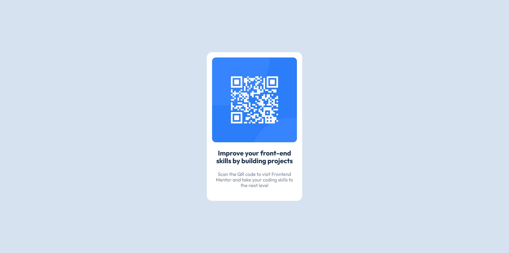

# Frontend Mentor - QR code component solution

This is a solution to the [QR code component challenge on Frontend Mentor](https://www.frontendmentor.io/challenges/qr-code-component-iux_sIO_H). Frontend Mentor challenges help you improve your coding skills by building realistic projects. 

## Table of contents

- [Overview](#overview)
  - [Screenshot](#screenshot)
  - [Links](#links)
- [My process](#my-process)
  - [Built with](#built-with)
  - [What I learned](#what-i-learned)
  - [Continued development](#continued-development)
- [Author](#author)

## Overview

### Screenshot

### Links

- Solution URL: [https://github.com/GSD3v08/qr-code](https://github.com/GSD3v08/qr-code)
- Live Site URL: [https://gsd3v08.github.io/qr-code/](https://gsd3v08.github.io/qr-code/)

## My process

### Built with

- Semantic HTML5 markup
- CSS custom properties
- Flexbox

### What I learned

In this challenge I learned:
- that adding some padding to bottom of the main container in this case 'card' helps to always have a little space between the last element we add and the bottom of the box.
- how horizontal/vertical align works relative to viewport. 
- how rem & em units work.

Maybe these concepts are not so important but I'm just keep learning step by step.

### Continued development

- Keep using flexbox until I get used to it.
- Next challenges I will focus on how responsive works and try to implement in future designs.

## Author

- Frontend Mentor - [@GSD3v08](https://www.frontendmentor.io/profile/GSD3v08)

